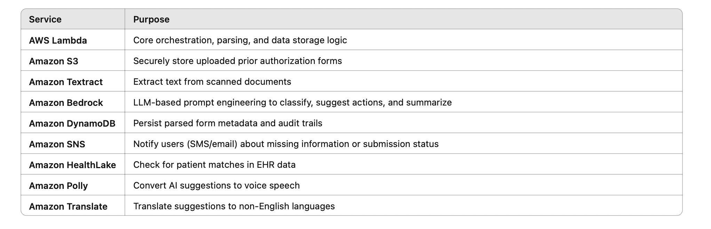

# HealthCopilot: Serverless Prior Authorization Tracker for U.S. Patients

## Overview
HealthCopilot is a serverless, AI-powered application built with AWS Lambda to help U.S. patients and healthcare clinics efficiently track insurance prior authorization requests. It automates document parsing, validates missing information, and proactively sends alerts through email.

## Features
Upload scanned prior authorization forms directly to Amazon S3
- Automatically extract key fields using Amazon Textract
- Analyze extracted text with Amazon Bedrock (Claude/Mistral)
- Classify provider, urgency, and detect missing fields through LLM prompts
- Store clean structured data in DynamoDB
- Notify clinics with Amazon SNS or Twilio for incomplete submissions
- Schedule automatic follow-ups with Amazon EventBridge

## AI/ML Capabilities
HealthCopilot uses advanced generative AI to optimize healthcare document workflows:
    -   Amazon Textract: extracts raw text from scanned forms
    -   Amazon Bedrock (Claude/Mistral):
    -   Identifies missing fields in the prior authorization form
    -   Classifies urgency (Routine, Urgent, Unknown)
    -   Extracts or validates insurance provider
    -   Suggests next best actions based on document content

## AI Prompt Example (used with Bedrock)
```
Given the following extracted text from a healthcare prior authorization form, identify:
1. Insurance Provider
2. Urgency Level (Routine/Urgent/Unknown)
3. NPI Number
4. Whether required fields are missing
5. Suggested next action
```

## Architecture Diagram


## AWS Services Used




## 📂 Project Structure
```
healthcopilot/
├── lambda/
│   ├── handler.py
│   ├── parser.py
│   └── notifier.py
├── eventbridge/
│   └── check_status.py
├── utils/
│   └── textract_helper.py
├── templates/
│   └── sample_prior_auth.pdf
├── README.md
└── requirements.txt
```

## 📥 Setup Instructions
1. Clone the repo:
   ```bash
   git clone https://github.com/your-username/healthcopilot.git
   cd healthcopilot
   ```

2. Deploy Lambda functions using AWS Console or SAM CLI.
3. Create an S3 bucket and configure it to trigger `handler.py` Lambda.
4. Set up DynamoDB table `prior_auth_requests`.
5. Enable Amazon Textract and Bedrock permissions for Lambda IAM role.
6. Configure SNS (or Twilio) with verified phone numbers or email.
7. Add EventBridge rule to run `check_status.py` every 3 days.

## 🧪 How It Works
1. Clinic uploads prior auth form → triggers Lambda
2. Lambda sends to Textract → extracts text
3. Text sent to Bedrock → identifies key values and missing fields
4. Parsed data saved to DynamoDB → alerts triggered if needed
5. EventBridge triggers follow-up notifications for stale entries

## 🎥 Demo Video
[Watch the demo here](https://youtu.be/example)

## 📜 License
MIT License
