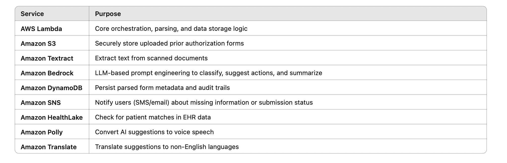

# HealthCopilot: Serverless Prior Authorization Tracker for U.S. Patients

## Overview
HealthCopilot is a serverless, AI-powered application built with AWS Lambda to help U.S. patients and healthcare clinics efficiently track insurance prior authorization requests. It automates document parsing, validates missing information, and proactively sends alerts through email.

## Features
Upload scanned prior authorization forms directly to Amazon S3
- Automatically extract key fields using Amazon Textract
- Analyze extracted text with Amazon Bedrock (Claude/Mistral)
- Classify provider, urgency, and detect missing fields through LLM prompts
- Store clean structured data in DynamoDB
- Notify clinics with Amazon SNS or Twilio for incomplete submissions
- Schedule automatic follow-ups with Amazon EventBridge

## AI/ML Capabilities
HealthCopilot uses advanced generative AI to optimize healthcare document workflows:
    -   Amazon Textract: extracts raw text from scanned forms
    -   Amazon Bedrock (Claude/Mistral):
    -   Identifies missing fields in the prior authorization form
    -   Classifies urgency (Routine, Urgent, Unknown)
    -   Extracts or validates insurance provider
    -   Suggests next best actions based on document content

## AI Prompt Example (used with Bedrock)

Given the following extracted text from a healthcare prior authorization form, identify:
    1. Insurance Provider
    2. Urgency Level (Routine/Urgent/Unknown)
    3. NPI Number
    4. Whether required fields are missing
    5. Suggested next action

## AWS Services Used

## Architecture Diagram

## Architecture Explained
-   Amazon S3 — receives the uploaded prior authorization forms (PDFs)
-   S3 triggers Lambda — to start the processing flow automatically
-   AWS Lambda — coordinates Textract (OCR), Bedrock (AI prompts), HealthLake (EHR search), and SNS alerts
-   Amazon Textract — extracts the text fields from the PDF
-   Amazon Bedrock — uses Claude/Mistral to analyze fields, detect missing data, and suggest next actions
-   Amazon DynamoDB — stores the structured parsed results and audit logs
-   Amazon Polly + Translate — reads the suggestions aloud in multiple languages
-   Amazon EventBridge (if included) — could schedule reminders for stale requests
-   Amazon HealthLake — matches patient data to cross-check missing info
-   Streamlit — provides a web-based dashboard for users to monitor the status

## Project Structure

##  Setup Instructions

Follow these steps to deploy HealthCopilot end-to-end:

1. Clone the repo:
    - git clone https://github.com/jinenmodi810/healthcopilot.git
    - cd healthcopilot
2. Deploy Lambda Functions
   - Use the AWS Lambda console to upload lambda_code/handler.py (or zip the entire folder including utils if you have dependencies).
   - Set the handler to lambda_code.handler.lambda_handler.
   - Attach an IAM role with Textract, Bedrock, Comprehend, HealthLake, DynamoDB, SNS, and S3 permissions.
   - Set the S3 trigger for the healthcopilot-docs bucket, prefix uploads/.
3. Set Up DynamoDB
   - Create a table named prior_auth_requests with primary key: form_id (String)
   - No secondary indexes are required initially.
4. Configure Amazon S3
   - Create a bucket healthcopilot-docs.
   - Add a folder prefix: uploads/.
   - Configure event triggers to point to your Lambda function.
5. Configure Amazon SNS 
    - Set up a topic (e.g., healthcopilot-alerts)
    - Subscribe your test email or phone number.
    - Add the topic ARN to your Lambda code (SNS_TOPIC_ARN).
6. Streamlit Frontend
    - Install dependencies locally:
    - cd streamlit_app
    - pip install -r requirements.txt
7. Run the Streamlit app:
    - streamlit run app.py
    - The dashboard will be available on http://localhost:8501
8. Permissions
    - Ensure your Lambda IAM role includes:
    - AmazonTextractFullAccess
    - AmazonBedrockFullAccess
    - AmazonDynamoDBFullAccess
    - AmazonSNSFullAccess
    - AmazonS3FullAccess
    - AmazonHealthLakeFullAccess
    - AmazonComprehendFullAccess
    - This is critical so all modules work seamlessly.
10. Test End-to-End
    - Upload templates/sample_prior_auth.pdf through the Streamlit dashboard
    - Confirm results appear, alerts go out, and the DynamoDB record is created.

## How It Works

HealthCopilot automates the end-to-end prior authorization workflow with an intuitive serverless architecture:

1. **Document Upload**  
   - Clinics or staff scan a prior authorization form and upload it via the Streamlit web dashboard.  
   - The PDF is stored in the S3 bucket under `uploads/`.

2. **S3 Trigger & Lambda Processing**  
   - An S3 event automatically triggers the main Lambda function.  
   - Lambda pulls the document from S3 and calls Amazon Textract to extract raw text.

3. **AI-Powered Parsing with Bedrock**  
   - The extracted text is sent to Amazon Bedrock (Claude/Mistral) for LLM-based parsing.  
   - Bedrock identifies key elements such as the provider, urgency, NPI, diagnosis, and any missing fields.  
   - It also suggests next actions, such as returning to the provider or flagging for urgent review.

4. **Patient Matching with HealthLake**  
   - The Lambda queries Amazon HealthLake to see if the patient already exists in the EHR, matching on name.  
   - If found, it logs a `healthlake_match` flag in DynamoDB for reference.

5. **Saving to DynamoDB**  
   - The structured data is stored in a DynamoDB table (`prior_auth_requests`) along with an audit trail and processing status.

6. **Notifications with SNS**  
   - If any required fields are missing, an alert is sent out using Amazon SNS to notify the clinic team.

7. **Streamlit Dashboard**  
   - The Streamlit app fetches records from DynamoDB and displays them on a user-friendly dashboard.  
   - Staff can view missing fields, provider details, HealthLake match status, and even request AI-generated suggestions on how to fix incomplete submissions.

8. **Voice Playback & Multilingual Support**  
   - With Amazon Translate and Polly, staff can listen to AI suggestions in multiple languages for accessibility.

9. **Audit Trail & Status Updates**  
   - Admins can update the authorization status and leave comments, which are logged in DynamoDB.  
   - All updates are reflected in real-time on the dashboard.

## Demo Video
[Watch the demo here](https://youtu.be/example)

## License
MIT License
